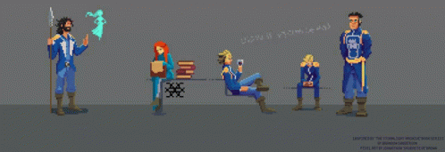

  

<h1 align="center">
    
</h1>

<h3>Little facts about me 🧑</h3>

- 👷 I'm a enthusiastic of programming
- 🔭 Certifications:
  - ESO
  - Bachillerato
  - FP of Web Aplication Development (DAW)
  - B2 Cambridge
- ⚡ Fun fact: I love videogames, football, Cosmere.
 

  

      

<h2 align="center">⚒️ Languages-Frameworks-Tools ⚒️</h2>
 
 

     
     

  

 

<h2 align="center"> ✏️ Contributions ✏️</h2>
 

 

[

 

 
